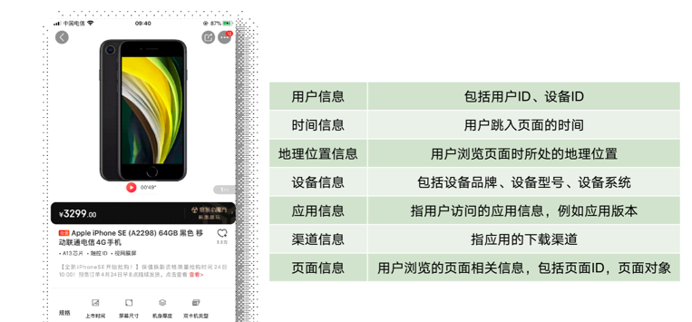
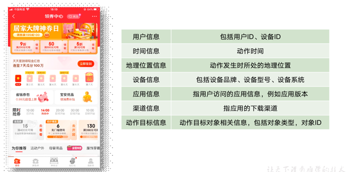

# 电商日志采集
## 业务需求
对电商业务产生的日志、业务数据等用户行为数据进行采集，收集这些信息的主要目的是优化产品和为各项分析统计指标提供数据支撑。
### 页面数据
主要记录一个页面的用户访问情况，包括访问时间、停留时间、页面路径等信息  

### 事件数据
事件数据主要记录应用内一个具体的操作行为，包括操作类型、操作对象、操作对象描述等信息

## 环境搭建
### 脚本工具
编写查看所有节点进程的脚本，本质就是向每个节点发送 jps 命令，脚本名为 xcall.sh
```shell
vim xcall.sh
```
xcall 脚本内容如下：
```shell
#!/bin/bash
#1. 判断参数是否为空，为空，则向每个节点发送jps命令
if (($#==0));then
 for host in Master1 Slave1 Slave2
   do
        echo =============== $host ===============
        ssh $host jps 
   done
 eval "exit"
else
#2. 非空时，则将参数发送到每个节点执行
for host in Master1 Slave1 Slave2
   do
        echo =============== $host ===============
        ssh $host $* 
   done
eval "exit"
fi
```
编写节点间分发数据的脚本，内部使用的是 rsync 命令，脚本名为 xsync.sh  
因脚本底层使用的时 rsync 命令，所以，先安装 rsync 命令: `apt -y install rsync`
```shell
#!/bin/bash
# 1. 判断参数个数
if [ $# == 0 ]
then
  echo " 请输入要分发的文件/目录"&&exit
fi
# 2. 遍历节点
for host in Master1 Slave1 Slave2
  do
    echo ========== $host ==========
    # 3. 遍历每个目录/文件
    for file in $@
      do
        # 4. 判断是否是文件/目录
        if [ -e $file ]
          then
          # 5. 获取父目录
          pdir=$(cd -P $(dirname $file); pwd)
          # 6. 获取文件名称
          fname=$(basename $file)
          # 7. 创建父目录
          ssh $host "mkdir -p ${pdir}"
          # 8. 分发文件
          rsync -av ${pdir}/${fname} ${host}:${pdir}
        else
          echo "$file 文件不存在！"
        fi
      done
  done
```
上传脚本到 Master1:
```shell
cd /home/root/
mkdir bin
vim xcall.sh
vim xsync.sh
chmod +x xcall
chmod +x xsync
```
### 安装 kafka
新建一个 module 目录：
```shell
mkdir /opt/module
```
kafka 下载地址：https://mirrors.aliyun.com/apache/kafka/3.0.2/kafka_2.12-3.0.2.tgz
将其放到 /opt/module 目录下，解压并修改包名：
```shell
tar -zxvf kafka_2.12-3.0.2.tgz -C /opt/module/
mv kafka_2.12-3.0.2 kafka
```
修改config目录下的配置文件 server.properties 内容如下:
```shell
#broker的全局唯一编号，不能重复，只能是数字。
broker.id=102
#处理网络请求的线程数量
num.network.threads=3
#用来处理磁盘IO的线程数量
num.io.threads=8
#发送套接字的缓冲区大小
socket.send.buffer.bytes=102400
#接收套接字的缓冲区大小
socket.receive.buffer.bytes=102400
#请求套接字的缓冲区大小
socket.request.max.bytes=104857600
#kafka运行日志(数据)存放的路径，路径不需要提前创建，kafka自动帮你创建，可以配置多个磁盘路径，路径与路径之间可以用"，"分隔
log.dirs=/opt/module/kafka/datas
#topic在当前broker上的分区个数
num.partitions=1
#用来恢复和清理data下数据的线程数量
num.recovery.threads.per.data.dir=1
# 每个topic创建时的副本数，默认时1个副本
offsets.topic.replication.factor=1
#segment文件保留的最长时间，超时将被删除
log.retention.hours=168
#每个segment文件的大小，默认最大1G
log.segment.bytes=1073741824
# 检查过期数据的时间，默认5分钟检查一次是否数据过期
log.retention.check.interval.ms=300000
#配置连接Zookeeper集群地址（在zk根目录下创建/kafka，方便管理）
zookeeper.connect=Master:2181,Slave1:2181,Slave2:2181/kafka
```
配置环境变量：
```shell
sudo vim /etc/profile.d/my_env.sh
#KAFKA_HOME
export KAFKA_HOME=/opt/module/kafka
export PATH=$PATH:$KAFKA_HOME/bin
```
使环境变量生效：
```shell
source /etc/profile
```
分发环境变量文件并source：
```shell
xsync.sh /etc/profile.d/my_env.sh
xcall source /etc/profile
```
分发 kafka 到其他节点：
```shell
xsync.sh /opt/module/kafka
```
修改配置文件中的 brokerid，分别在hadoop103和hadoop104上修改配置文件server.properties中broker.id=103、broker.id=104
```shell
# 在 Slave1 上
vim /opt/module/kafka/config/server.properties
broker.id=103

# 在 Slave2 上
vim /opt/module/kafka/config/server.properties
broker.id=104
```
启动集群：
先启动Zookeeper集群
```shell
zkServer.sh start
```
依次在 Master1、Slave1、Slave2 节点上启动 kafka:
```shell
kafka-server-start.sh -daemon /opt/module/kafka/config/server.properties
```
### 安装 flume
flume 下载地址：https://mirrors.aliyun.com/apache/flume/1.9.0/apache-flume-1.9.0-bin.tar.gz 将其放到 /opt/module 下并解压：
```shell
tar -zxvf apache-flume-1.9.0-bin.tar.gz -C /opt/module/
mv apache-flume-1.9.0-bin flume
```
将lib文件夹下的guava-11.0.2.jar删除：
```shell
rm -rf /opt/module/flume/lib/guava-11.0.2.jar
```
分发 flume 到其他节点：
```shell
xsync.sh /opt/module/flume
```
## 模拟日志数据生产
下载文件夹并解压放到 /opt/module 目录下：
链接: https://pan.baidu.com/s/1hhLIYRG-AP5LRLRMeRiR8A?pwd=63e8 提取码: 63e8
--来自百度网盘超级会员v2的分享
配置文件application.yml：
```shell
vim application.yml
# 外部配置打开
logging.config: "./logback.xml"
#业务日期：注意，这里的日期指的是生成的数据中的时间。
mock.date: "2020-06-14"

#模拟数据发送模式
#mock.type: "http"
#mock.type: "kafka"
mock.type: "log"

#http模式下，发送的地址
mock.url: "http://Master/applog"

#kafka模式下，发送的地址
mock:
  kafka-server: "hdp1:9092,hdp2:9092,hdp3:9092"
  kafka-topic: "ODS_BASE_LOG"

#启动次数
mock.startup.count: 200
#设备最大值
mock.max.mid: 500000
#会员最大值
mock.max.uid: 100
#商品最大值
mock.max.sku-id: 35
#页面平均访问时间
mock.page.during-time-ms: 20000
#错误概率 百分比
mock.error.rate: 3
#每条日志发送延迟 ms
mock.log.sleep: 10
#商品详情来源  用户查询，商品推广，智能推荐, 促销活动
mock.detail.source-type-rate: "40:25:15:20"
#领取购物券概率
mock.if_get_coupon_rate: 75
#购物券最大id
mock.max.coupon-id: 3
#搜索关键词  
mock.search.keyword: "图书,小米,iphone11,电视,口红,ps5,苹果手机,小米盒子"
```
配置文件logback.xml:
```xml
<?xml version="1.0" encoding="UTF-8"?>
<configuration>
    <property name="LOG_HOME" value="/opt/module/applog/log" />
    <appender name="console" class="ch.qos.logback.core.ConsoleAppender">
        <encoder>
            <pattern>%msg%n</pattern>
        </encoder>
    </appender>

    <appender name="rollingFile" class="ch.qos.logback.core.rolling.RollingFileAppender">
        <rollingPolicy class="ch.qos.logback.core.rolling.TimeBasedRollingPolicy">
            <fileNamePattern>${LOG_HOME}/app.%d{yyyy-MM-dd}.log</fileNamePattern>
        </rollingPolicy>
        <encoder>
            <pattern>%msg%n</pattern>
        </encoder>
    </appender>

    <!-- 将某一个包下日志单独打印日志 -->
    <logger name="com.atgugu.gmall2020.mock.log.util.LogUtil"
            level="INFO" additivity="false">
        <appender-ref ref="rollingFile" />
        <appender-ref ref="console" />
    </logger>

    <root level="error"  >
        <appender-ref ref="console" />
    </root>
</configuration>
```
进入到/opt/module/applog路径，执行如下命令：
```shell
java -jar gmall2020-mock-log-2021-01-22.jar
```
配置集群日志生成脚本，在用户根目录 /home/root/bin 下创建日志脚本文件 lg.sh, 我们分别在 Master 和 Slave1 上模拟用户行为日志数据。
```shell
#!/bin/bash
for host in hadoop102 hadoop103; do
    echo "========== $host =========="
    ssh $host "cd /opt/module/applog/; java -jar gmall2020-mock-log-2021-01-22.jar >/dev/null 2>&1 &"
done
```
修改脚本执行权限：
```shell
chmod +x lg.sh
```
## 自定义flume拦截器
1．创建Maven 工程flume_interceptor
2．创建包名： com.atguigu.flume.interceptor
3．在pom.xml文件中添加如下配置
```xml
<dependencies>
    <dependency>
        <groupId>org.apache.flume</groupId>
        <artifactId>flume-ng-core</artifactId>
        <version>1.9.0</version>
        <scope>provided</scope>
    </dependency>

    <dependency>
        <groupId>com.alibaba</groupId>
        <artifactId>fastjson</artifactId>
        <version>1.2.62</version>
    </dependency>
</dependencies>

<build>
    <plugins>
        <plugin>
            <artifactId>maven-compiler-plugin</artifactId>
            <version>2.3.2</version>
            <configuration>
                <source>1.8</source>
                <target>1.8</target>
            </configuration>
        </plugin>
        <plugin>
            <artifactId>maven-assembly-plugin</artifactId>
            <configuration>
                <descriptorRefs>
                    <descriptorRef>jar-with-dependencies</descriptorRef>
                </descriptorRefs>
            </configuration>
            <executions>
                <execution>
                    <id>make-assembly</id>
                    <phase>package</phase>
                    <goals>
                        <goal>single</goal>
                    </goals>
                </execution>
            </executions>
        </plugin>
    </plugins>
</build>
```
4．在com.atguigu.flume.interceptor包下创建JSONUtils类
```java
package com.atguigu.flume.interceptor;
import com.alibaba.fastjson.JSON;
import com.alibaba.fastjson.JSONObject;
/**
 * @author leon
 * @ClassName JSONUtils.java
 * @createTime 2022年01月23日 02:22:00
 */
public class JSONUtils {
    public static boolean isJSONValidate(String log){
        try {
            // 1. 解析JSON字符串
            JSON.parseObject(log);
            return true;
        } catch (Exception e) {
            // 2. 失败了，证明不是JSON字符串
            return false;
        }
    }
}
```
5．在com.atguigu.flume.interceptor包下创建ETLInterceptor类
```java
package com.atguigu.flume.interceptor;

import org.apache.flume.Context;
import org.apache.flume.Event;
import org.apache.flume.interceptor.Interceptor;
import java.nio.charset.StandardCharsets;
import java.util.Iterator;
import java.util.List;

/**
 * @author leon
 * @ClassName ETLInterceptor.java
 * @createTime 2022年01月23日 02:25:00
 */
public class ETLInterceptor implements Interceptor {
    @Override
    public void initialize() {}

    @Override
    public Event intercept(Event event) {
        // 1. 获取事件体
        byte[] body = event.getBody();
        // 2. 解析事件体为字符串
        String log = new String(body, StandardCharsets.UTF_8);
        // 3.判断是否是JSON字符串
        if(JSONUtils.isJSONValidate(log))
            // 是，返回事件
            return event;
        else
            // 不是，返回空
            return null;
    }

    /**
     * @param events
     * @describe 在这里，真正的将不符合要求的事件移除
     * @return
     */
    @Override
    public List<Event> intercept(List<Event> events) {
       Iterator<Event> iterator = events.iterator();
        while (iterator.hasNext()){
            Event next = iterator.next();
            if(intercept(next)==null){
                // 将不是json格式的数据移除
                iterator.remove();
            }
        }
        return events;
    }

    @Override
    public void close() {

    }
    
    public static class Builder implements Interceptor.Builder{

        @Override
        public Interceptor build() {
            return new ETLInterceptor();
        }

        @Override
        public void configure(Context context) {

        }
    }
}
```
6.打包上传到 Master 的 /opt/module/flume/lib 文件夹下
7.分发flume的lib目录到其他节点
```shell
xsync /opt/module/flume/lib
```
## 编写日志采集flume的配置文件
1. 在flume的根目录下创建job目录，在job中创建Agent配置文件flume-tailDir-kafka.conf
```shell
mkdir /opt/module/flume/job
vim flume-tailDir-kafka.conf
#为各组件命名
a1.sources = r1
a1.channels = c1

#描述source
a1.sources.r1.type = TAILDIR
a1.sources.r1.filegroups = f1
a1.sources.r1.filegroups.f1 = /opt/module/applog/log/app.*
a1.sources.r1.positionFile = /opt/module/flume/taildir_position.json
a1.sources.r1.interceptors =  i1
a1.sources.r1.interceptors.i1.type = com.atguigu.flume.interceptor.ETLInterceptor$Builder

#描述channel
a1.channels.c1.type = org.apache.flume.channel.kafka.KafkaChannel
a1.channels.c1.kafka.bootstrap.servers = Master:9092,Slave1:9092
a1.channels.c1.kafka.topic = topic_log
a1.channels.c1.parseAsFlumeEvent = false

#绑定source和channel以及sink和channel的关系
a1.sources.r1.channels = c1
```
2. 同步配置文件到其他节点（主要是 Slave1 和 Slave2 上）
```shell
xsync /opt/module/flume/job
```
## 编写启动停止脚本
1. 创建logs文件夹
```shell
xcall.sh mkdir -p /opt/module/flume/logs
```
2. 在用户根目录 /home/root/bin/ 下创建脚本文件f1.sh
```shell
vim f1.sh
#!/bin/bash
# 1. 判断是否存在参数
if [ $# == 0 ];then
  echo -e "请输入参数：\nstart   启动日志采集flume；\nstop   关闭日志采集flume；"&&exit
fi

FLUME_HOME=/opt/module/flume

# 2. 根据传入的参数执行命令
case $1 in
  "start"){
      # 3. 分别在Master Slave1 上启动日志采集flume
      for host in Master Slave1
        do
          echo "---------- 启动 $host 上的 日志采集flume ----------"
          ssh $host " nohup $FLUME_HOME/bin/flume-ng agent -n a1 -c $FLUME_HOME/conf/ -f $FLUME_HOME/job/flume-tailDir-kafka.conf -Dflume.root.logger=INFO,LOGFILE >$FLUME_HOME/logs/flume.log 2>&1 &"
        done
  };;
"stop"){
      # 4. 分别在Master Slave1 上启动日志采集flume
      for host in Master Slave1
        do
          echo "---------- 停止 $host 上的 日志采集flume ----------"
          flume_count=$(xcall jps -ml | grep flume-tailDir-kafka|wc -l);
          if [ $flume_count != 0 ];then
              ssh $host "ps -ef | grep flume-tailDir-kafka | grep -v grep | awk '{print \$2}' | xargs -n1 kill -9"
          else
              echo "$host 当前没有日志采集flume在运行"
          fi
        done
  };;
esac
```
3. 给脚本赋予执行权限
```shell
chmod +x f1.sh
```

## 测试
1. 测试前确保 zookeeper 和 kafka 集群已启动
2. 日志采集 flume 集群启动
```shell
f1.sh start
```
3. 启动模拟日志数据程序
```shell
lg.sh
```
4. 查看kafka中是否创建出新的 topic_log
```shell
kafka-topics.sh --bootstrap-server Master:9092 --list
```
5. 启动一个消费者，从头消费topic_log中的数据
```shell
kafka-console-consumer.sh --bootstrap-server Master:9092 --topic topic_log --from-beginning
```
6. 可以看到消费了数据
```
{"common":{"ar":"530000","ba":"iPhone","ch":"Appstore","is_new":"0","md":"iPhone Xs","mid":"mid_113166","os":"iOS 13.2.9","uid":"60","vc":"v2.1.132"},"page":{"during_time":19146,"last_page_id":"home","page_id":"search"},"ts":1592103271000}
{"common":{"ar":"530000","ba":"iPhone","ch":"Appstore","is_new":"0","md":"iPhone Xs","mid":"mid_113166","os":"iOS 13.2.9","uid":"60","vc":"v2.1.132"},"displays":[{"display_type":"query","item":"29","item_type":"sku_id","order":1,"pos_id":1},{"display_type":"query","item":"35","item_type":"sku_id","order":2,"pos_id":3},{"display_type":"promotion","item":"32","item_type":"sku_id","order":3,"pos_id":3},{"display_type":"query","item":"33","item_type":"sku_id","order":4,"pos_id":5},{"display_type":"query","ite
```
7. 日志采集flume集群关闭
```shell
f1.sh stop
```